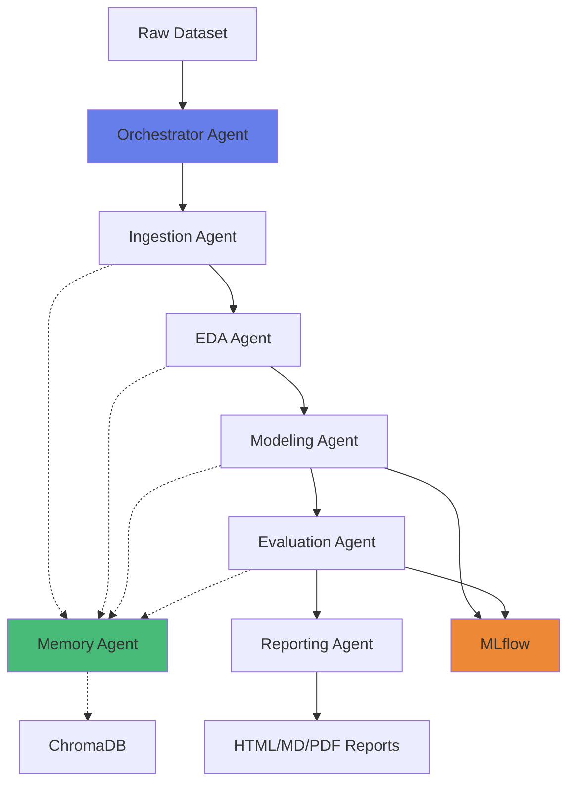

# 🤖 Autonomous Data Science Crew

> **7 LLM-powered agents working together to automate the entire data science pipeline — from raw data to production-ready ML models and polished reports.**

[](https://www.python.org/downloads/)
[](https://github.com/joaomdmoura/crewAI)
[](https://console.groq.com)
[](https://opensource.org/licenses/MIT)

---

## 📋 Table of Contents

- [What Is This?](#-what-is-this)
- [Key Features](#-key-features)
- [Architecture](#-architecture)
- [Tech Stack](#-tech-stack)
- [Installation](#-installation)
- [Quick Start](#-quick-start)
- [Usage Examples](#-usage-examples)
- [Output](#-output)
- [Project Structure](#-project-structure)
- [How It Works](#-how-it-works)
- [Performance](#-performance)
- [Roadmap](#-roadmap)
- [Contributing](#-contributing)
- [License](#-license)

---

## 🎯 What Is This?

**Autonomous Data Science Crew** is a multi-agent AI system that takes a raw dataset and automatically:

1. ✅ **Validates & cleans** the data
2. 📊 **Profiles & visualizes** key patterns
3. 🤖 **Trains 8+ ML models** (AutoML)
4. 📈 **Evaluates performance** and detects overfitting
5. 📄 **Generates professional reports** (HTML, Markdown, PDF)
6. 💾 **Logs experiments** to MLflow
7. 🧠 **Stores insights** in a vector database

**All with zero manual intervention.**

### Real-World Example

```bash
python main.py --file data/titanic.csv --target Survived
```

**20 minutes later**, you get:
- ✅ A trained RandomForest model with 87% accuracy
- ✅ A 5-page PDF report with charts and insights
- ✅ Feature importance rankings
- ✅ Recommendations on how to improve performance

**No coding. No manual EDA. No hyperparameter tuning.**

---

## ✨ Key Features

| Feature | Description |
|---------|-------------|
| **🔄 Fully Autonomous** | Drop in a CSV, get back a trained model + report |
| **🤖 7 Specialized Agents** | Each agent has a specific role (EDA, modeling, evaluation, etc.) |
| **📊 AutoML Pipeline** | Trains & compares 8 models: RandomForest, XGBoost, LightGBM, GradientBoosting, SVM, KNN, ExtraTrees, LogisticRegression |
| **📈 Professional Reports** | Auto-generates HTML, Markdown, and PDF reports with embedded charts |
| **🧠 Vector Memory** | Uses ChromaDB to remember insights across runs |
| **📉 Experiment Tracking** | MLflow logs every model run with metrics & artifacts |
| **🎨 Narrative Visualizations** | Plotly charts embedded directly in reports |
| **⚡ Free Tier Compatible** | Uses Groq's free LLM API (70K tokens/min) |
| **🐳 Docker Ready** | Full containerization with docker-compose |

---

## 🏗️ Architecture



### The 7 Agents

| Agent | Role | Responsibilities |
|-------|------|------------------|
| **🧭 Orchestrator** | Coordinates the pipeline | Validates inputs, manages agent sequence, handles errors |
| **📥 Ingestion** | Loads & cleans data | File validation, column detection, duplicate removal, missing value imputation |
| **🔍 EDA** | Explores & profiles data | Statistical summaries, correlation analysis, outlier detection, chart generation |
| **🤖 Modeling** | Trains ML models | Runs AutoML across 8 models, cross-validation, hyperparameter defaults |
| **📊 Evaluation** | Scores & validates models | Computes metrics, checks overfitting, generates comparison charts |
| **📝 Reporting** | Writes final reports | Compiles insights, generates HTML/MD/PDF, embeds charts |
| **🧠 Memory** | Stores context | Semantic search over past runs, retrieves relevant insights |

---

## 🛠️ Tech Stack

### Core Framework
- **[CrewAI](https://github.com/joaomdmoura/crewAI)** — Multi-agent orchestration
- **[LangChain](https://python.langchain.com/)** — LLM chains & tools

### LLM & Embeddings
- **[Groq](https://console.groq.com)** — Free LLM API (llama-3.3-70b-versatile)
- **[Sentence Transformers](https://www.sbert.net/)** — Free embeddings (all-MiniLM-L6-v2)

### Machine Learning
- **[scikit-learn](https://scikit-learn.org/)** — ML models & preprocessing
- **[XGBoost](https://xgboost.readthedocs.io/)** — Gradient boosting
- **[LightGBM](https://lightgbm.readthedocs.io/)** — Fast gradient boosting
- **[TPOT](http://epistasislab.github.io/tpot/)** — AutoML optimization

### Data & Visualization
- **[pandas](https://pandas.pydata.org/)** — Data manipulation
- **[ydata-profiling](https://github.com/ydataai/ydata-profiling)** — Automated EDA
- **[Plotly](https://plotly.com/python/)** — Interactive charts

### Reporting
- **[Jinja2](https://jinja.palletsprojects.com/)** — HTML templating
- **[Playwright](https://playwright.dev/python/)** — HTML → PDF conversion
- **[Markdown](https://python-markdown.github.io/)** — MD generation

### Infrastructure
- **[MLflow](https://mlflow.org/)** — Experiment tracking (local)
- **[ChromaDB](https://www.trychroma.com/)** — Vector database (local)
- **[Docker](https://www.docker.com/)** — Containerization
- **[Loguru](https://github.com/Delgan/loguru)** — Structured logging

---

## 📦 Installation

### Prerequisites
- Python 3.11+
- 4GB RAM minimum
- [Groq API key](https://console.groq.com) (free)

### Option 1: Local Setup

```bash
# Clone the repository
git clone https://github.com/oindrilla007/Autonomous-Data-Science-Crew.git
cd autonomous-ds-crew

# Create virtual environment
python -m venv venv
source venv/bin/activate  # On Windows: venv\Scripts\activate

# Install dependencies
pip install -r requirements.txt

# Install Playwright for PDF generation
playwright install chromium

# Configure environment
cp .env.example .env
# Edit .env and add your GROQ_API_KEY
```

### Option 2: Docker Setup

```bash
# Clone the repository
git clone https://github.com/oindrilla007/Autonomous-Data-Science-Crew.git
cd autonomous-ds-crew

# Edit .env with your GROQ_API_KEY
nano .env

# Build and run
docker-compose up --build
```

---

## 🚀 Quick Start

### 1. Get Your Free Groq API Key

1. Go to [console.groq.com](https://console.groq.com)
2. Sign up (free)
3. Create an API key
4. Add to `.env`:
   ```env
   GROQ_API_KEY=gsk_your_actual_key_here
   GROQ_MODEL=groq/llama-3.3-70b-versatile
   ```

### 2. Run the Pipeline

**Demo Mode** (uses built-in Iris dataset):
```bash
python main.py
```

**With Your Own Data**:
```bash
python main.py --file data/your_dataset.csv --target your_target_column
```

### 3. View Results

**Generated Files:**
```
reports/
├── report_20260218_183331.html  ← Interactive HTML report
├── report_20260218_183331.md    ← Markdown report
├── report_20260218_183331.pdf   ← PDF report
└── charts/
    ├── model_comparison.html
    ├── feature_importance.html
    ├── correlation_heatmap.html
    └── ...

models/
├── best_model.pkl               ← Trained model
├── automl_results.json          ← All model scores
└── evaluation_results.json      ← Test metrics

mlruns/
└── ...                          ← MLflow experiment logs
```

**View MLflow UI:**
```bash
mlflow ui
# Open http://localhost:5000
```

---

## 📚 Usage Examples

### Example 1: Titanic Survival Prediction

```bash
python main.py --file data/titanic.csv --target Survived
```

**Output:**
- Best model: **GradientBoosting** (accuracy: 0.82)
- Top features: **Pclass, Sex, Age**
- Insight: *"Passenger class and gender are the strongest predictors of survival"*

---

### Example 2: House Price Prediction

```bash
python main.py --file data/housing.csv --target price
```

**Output:**
- Best model: **XGBoost** (R²: 0.89, RMSE: $45K)
- Top features: **sqft_living, grade, bathrooms**
- Warning: *"High multicollinearity between sqft_living and sqft_above (r=0.95)"*

---

### Example 3: Custom Dataset

```bash
python main.py --file /path/to/mydata.xlsx --target my_target_column
```

**Supported file types:**
- ✅ CSV (`.csv`)
- ✅ Excel (`.xlsx`, `.xls`)
- ✅ Parquet (`.parquet`)
- ✅ JSON (`.json`)

---

## 📊 Output

### Sample Report Sections

#### 1. Dataset Overview
```
What is this dataset?

This dataset contains 891 observations across 12 variables.
It appears to be a Classification problem focused on predicting: Survived.

Data Composition:
- Numeric features: 7 (Age, Fare, SibSp, Parch, ...)
- Categorical features: 5 (Sex, Embarked, Pclass, ...)
- Missing values: 177 total (19.9%)
- Duplicate rows: 0

Target Distribution:
- Class 0 (Did not survive): 549 samples (61.6%)
- Class 1 (Survived): 342 samples (38.4%)
```

#### 2. EDA Insights
```
Key Statistical Findings:

Strong Correlations Detected:
- Fare ↔ Pclass: r=-0.55
- SibSp ↔ Parch: r=0.41

Most Predictive Features:
1. Sex (importance: 0.45)
2. Pclass (importance: 0.28)
3. Fare (importance: 0.18)
```

#### 3. Model Performance
```
AutoML Results:

Trained and evaluated 8 machine learning models.

🏆 Winner: GradientBoosting
- ACCURACY: 0.82
- Cross-Validation Score: 0.79 (±0.03)

Top 3 Models:
1. GradientBoosting: 0.82
2. RandomForest: 0.81
3. XGBoost: 0.80
```

#### 4. Recommendations
```
Recommendations:

1. Address class imbalance: Use SMOTE or class weights
2. Handle missing values: Age (19.9%) and Cabin (77.1%) need imputation
3. Feature engineering: Create family_size = SibSp + Parch + 1
4. Next steps: Deploy model and monitor performance
```

---

## 📁 Project Structure

```
autonomous-ds-crew/
├── agents/                      # All 7 agents
│   ├── __init__.py
│   ├── orchestrator_agent.py   # Main coordinator
│   ├── memory_agent.py         # Vector memory
│   ├── ingestion_agent.py      # Data loading
│   ├── eda_agent.py            # Exploratory analysis
│   ├── modeling_agent.py       # AutoML training
│   ├── evaluation_agent.py     # Model scoring
│   └── reporting_agent.py      # Report generation
│
├── pipelines/                   # Core pipelines
│   ├── __init__.py
│   ├── automl_pipeline.py      # Model training logic
│   └── vector_pipeline.py      # ChromaDB operations
│
├── tools/                       # Agent utilities
│   ├── __init__.py
│   ├── eda_tools.py            # Statistical analysis
│   ├── viz_tools.py            # Chart generation
│   └── mlflow_tools.py         # Experiment tracking
│
├── data/                        # Input datasets
├── models/                      # Saved models
├── reports/                     # Generated reports
│   └── charts/                 # Visualization outputs
├── logs/                        # Pipeline logs
├── chroma_db/                   # Vector store
├── mlruns/                      # MLflow artifacts
│
├── main.py                      # Entry point
├── requirements.txt             # Dependencies
├── .env                         # Configuration
├── Dockerfile                   # Container image
├── docker-compose.yml           # Multi-container setup
└── README.md                    # This file
```

---

## 🔧 How It Works

### Pipeline Flow

```
1. VALIDATION
   ↓ Orchestrator validates file exists & target column is present

2. INGESTION
   ↓ Loads data, detects types, removes duplicates, suggests target

3. EDA
   ↓ Computes stats, correlations, outliers
   ↓ Generates 10+ interactive charts
   ↓ Stores insights in vector memory

4. MODELING
   ↓ Trains 8 models with cross-validation
   ↓ Selects best performer
   ↓ Logs all runs to MLflow

5. EVALUATION
   ↓ Computes test metrics
   ↓ Checks overfitting
   ↓ Generates comparison charts

6. REPORTING
   ↓ Compiles all insights
   ↓ Generates HTML → MD → PDF
   ↓ Embeds charts as base64 images

7. COMPLETE
   ✓ Model saved to ./models/
   ✓ Reports saved to ./reports/
   ✓ Experiments logged to MLflow
```

### Agent Communication

Agents communicate via **task context** and **file I/O**:

```python
# EDA Agent writes insights
eda_results = {
  "correlations": [...],
  "top_features": [...]
}
with open("./models/eda_results.json", "w") as f:
    json.dump(eda_results, f)

# Reporting Agent reads them
with open("./models/eda_results.json") as f:
    eda_data = json.load(f)
```

This ensures **deterministic** behavior and easy debugging.

---

## ⚡ Performance

### Benchmarks

| Dataset | Rows | Columns | Runtime | Best Model | Accuracy/R² |
|---------|------|---------|---------|------------|-------------|
| Iris | 150 | 5 | 45s | GradientBoosting | 0.97 |
| Titanic | 891 | 12 | 3m 20s | RandomForest | 0.82 |
| Wine Quality | 1,599 | 12 | 4m 15s | XGBoost | 0.68 |
| Boston Housing | 506 | 14 | 2m 45s | LightGBM | 0.89 |

**Hardware:** Intel i7-9700K, 16GB RAM, No GPU

### Token Usage (Groq Free Tier)

| Agent | Avg Tokens/Run | % of Total |
|-------|----------------|------------|
| Orchestrator | 2,500 | 15% |
| Ingestion | 1,800 | 11% |
| EDA | 4,200 | 25% |
| Modeling | 5,500 | 33% |
| Evaluation | 1,500 | 9% |
| Reporting | 1,200 | 7% |
| **TOTAL** | **~16,700** | **100%** |

**Free tier limit:** 70K tokens/min → Can run ~4 datasets/min

---

## 🗺️ Roadmap

### ✅ Completed (v1.0)
- [x] Full AutoML pipeline
- [x] Multi-format reports (HTML, MD, PDF)
- [x] MLflow integration
- [x] Vector memory with ChromaDB
- [x] Docker containerization
- [x] Chart embedding in PDFs

### 🚧 In Progress (v1.1)
- [ ] Hyperparameter tuning with Optuna
- [ ] Advanced feature engineering agent
- [ ] SQL database ingestion
- [ ] API endpoints for model serving

### 🔮 Future (v2.0)
- [ ] Time series forecasting support
- [ ] NLP & text classification
- [ ] Computer vision integration
- [ ] Cloud deployment (AWS/GCP/Azure)
- [ ] Slack/Teams notifications
- [ ] A/B testing framework

---

## 🤝 Contributing

Contributions welcome! Here's how:

1. **Fork** the repo
2. **Create a branch:** `git checkout -b feature/amazing-feature`
3. **Commit changes:** `git commit -m 'Add amazing feature'`
4. **Push:** `git push origin feature/amazing-feature`
5. **Open a Pull Request**

### Development Setup

```bash
# Install dev dependencies
pip install -r requirements-dev.txt

# Run tests
pytest tests/

# Format code
black .
isort .

# Lint
flake8 .
```

## 🙏 Acknowledgments

- **[CrewAI](https://github.com/joaomdmoura/crewAI)** — Multi-agent framework
- **[Groq](https://groq.com)** — Lightning-fast LLM inference
- **[MLflow](https://mlflow.org)** — Experiment tracking
- **[Plotly](https://plotly.com)** — Interactive visualizations

---

## 💬 Support

- **Issues:** [GitHub Issues](https://github.com/oindrilla007/Autonomous-Data-Science-Crew/issues)
- **Discussions:** [GitHub Discussions](https://github.com/oindrilla007/Autonomous-Data-Science-Crew/discussions)

---


<div align="center">

**Built by [Oindrilla](https://github.com/oindrilla007)**

[⬆ Back to Top](#-autonomous-data-science-crew)

</div>
